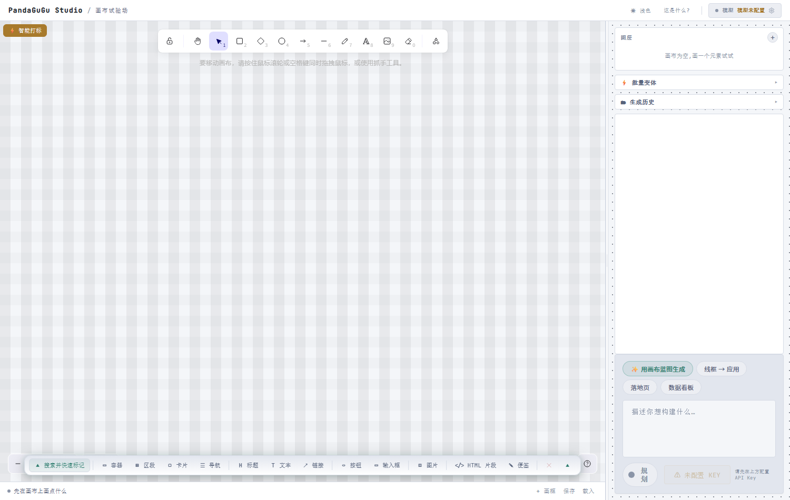

# PandaGuGu Studio

**画布式 HTML 生成器**——在画布上画元素、自动打语义标记、画框圈成页面区块，一键导出 JSON 蓝图交给 AI 生成完整 HTML。

纯前端，BYOK（自带 API Key），无需后端，运行在浏览器里。



## 与 Excalidraw 的关系（我们的优势）

PandaGuGu Studio 基于 MIT 开源的 [Excalidraw](https://github.com/excalidraw/excalidraw) 构建——它是成熟的开源无限画布引擎。我们不重复造轮子，而是把画布从"绘图白板"升级为**"视觉 → 代码"管线**：

| Excalidraw 原生 | PandaGuGu Studio 叠加 |
|---|---|
| 形状：矩形 / 椭圆 / 文字 / 图片 | **语义**：容器 / 标题 / 按钮 / 图片… 12 种页面元素 |
| 导出 PNG / 自有 JSON | **开放蓝图 JSON**：语义类型 + layout + zIndex，AI 直接消费生成 HTML |
| 画完即止（白板） | **AI 生成闭环**：画布 → 蓝图 → 流式生成 HTML → 沙箱预览 → 细化 |
| 画框 = 框选工具 | 画框 = `<section>` 页面结构（多画框 = 多区块页面） |
| 形状属性很少、靠手调 | 按语义类型属性面板（颜色/文字/圆角…），编辑实时 WYSIWYG |
| 元素列表扁平 | IDE 树形图层（画框 = 文件夹，▸/▾ 折叠，点击选中） |
| Shift 多选 | Ctrl/⌘ 多选 + 8 种对齐/等距分布（嘉立创风格） |

**一句话定位**：Excalidraw 是引擎，PandaGuGu Studio 是把它变成"画出来 → AI 写出代码"的产品。

## 核心工作流

```
① 画      — 用 Excalidraw 画矩形/文字/图片/椭圆…
② 标记    — 智能打标：矩形→容器、椭圆→按钮、文字→文本、图片→图片（画完自动标）
③ 圈区    — 画框圈住一块区域 = 一个 <section>（页面区块/一屏）
④ 生成    — 点「✨ 用画布蓝图生成」→ JSON 蓝图自动进提示词 → AI 生成 HTML
```

## 功能

- **语义类型系统（12 种）**：容器/区段/卡片/导航 + 标题/文本/链接 + 按钮/输入框 + 图片 + HTML片段/便签
- **智能打标**：画图自动匹配语义类型（顶部 ⚡ 开关）；也支持拖拽创建（点类型→画→自动标）
- **属性面板**：选中元素按类型编辑属性（颜色/文字/圆角…），编辑才同步画布，绝不改你的画
- **画框 = `<section>`**：画框圈出的区域导出为顶层 section 节点，框内元素成为 children
- **图层面板**：IDE 风格树形分级（画框=文件夹带 ▸/▾ 箭头），点击选中、− 删除
- **对齐工具**：左/右/水平居中 + 顶/底/垂直居中 + 等距分布（8 种，多选后底部 ▲ 菜单）
- **多选**：Ctrl/⌘+点击 切换选中（点选中的取消，未选中的加入）
- **JSON 蓝图导出**：画框级（缩略图 ⇩）或整画布（▲ 菜单），含 zIndex（叠层顺序）和 layout 提示
- **自动吸附**：Excalidraw 原生 smart guides（拖动红参考线）；元素拖进画框自动归属
- **主题**：浅色/深色切换，全站跟随
- **9 个模型服务商**：z.ai / DeepSeek / Kimi / 通义千问 / 火山方舟 / Google / Fireworks / OpenRouter / Custom

## 蓝图数据模型（v2）

```json
{
  "app": "pandagugu-studio", "kind": "blueprint", "version": 2,
  "title": "Hero", "theme": "dark",
  "elements": [
    { "type": "section", "label": "Hero", "x": 100, "y": 80, "w": 800, "h": 500,
      "zIndex": 0, "layout": "column",
      "props": { "label": "Hero" },
      "children": [
        { "type": "heading", "props": { "content": "新一代视觉画布" } },
        { "type": "text", "props": { "content": "画、标、生成" } },
        { "type": "button", "props": { "label": "立即开始" } }
      ] }
  ]
}
```

- **语义类型 → HTML**：section→`<section>`、container→`<div>`、heading→`<h1-h6>`、button→`<button>`、input→`<input>`、image→``、text→`<p>`、link→`<a>`、raw→原样嵌入、note→设计意图参考
- **layout 提示**：free→absolute，row/column/grid/wrap→flex/grid
- **zIndex**：重叠元素按它设 `z-index`

## 模型服务商

| 服务 | 端点 | 模型 |
|------|------|------|
| z.ai | api.z.ai | GLM-5V Turbo |
| DeepSeek | api.deepseek.com | deepseek-chat / deepseek-reasoner |
| Kimi | api.moonshot.cn | moonshot-v1 / kimi-k2 |
| 通义千问 | dashscope 兼容模式 | qwen-vl-plus / qwen-plus / qwen-max |
| 火山方舟 | ark.cn-beijing.volces.com | doubao-1.5-pro/lite、seed-1.6 |
| Google | generativelanguage | Gemini 3.1 Pro / Flash / Lite |
| Fireworks | api.fireworks.ai | Kimi K2.5 Turbo |
| OpenRouter | openrouter.ai | 100+ 模型（自动拉取） |
| Custom | 任意 | 任何 OpenAI 兼容端点 |

Key 存在浏览器 localStorage，不上传。

## 快捷键

- `Cmd/Ctrl + Enter`：提交生成/细化
- `Ctrl/⌘ + 点击`：切换多选
- `Shift + 点击` / 框选：多选

## 开发

```bash
npm install
npm run dev       # 开发，http://localhost:5173
npm run build     # 生产构建
npm run build:gh  # 部署到 /vcanvas/ 路径
```

## 架构

```
src/
  App.tsx                 — 编排中枢、状态、AI 管线（生成/细化/Plan）
  lib/
    blueprint.ts          — 语义类型 v2、蓝图序列化、zIndex/layout
    align.ts              — 8 种对齐/分布算法（纯坐标）
    providers.ts          — 9 服务商配置、状态持久化
    api.ts                — OpenAI 兼容 + Gemini 双协议 SSE 流式
    export.ts             — 画框/整画布 PNG 导出
    i18n.tsx              — 中英双语
  components/
    Canvas.tsx            — Excalidraw 实例、智能打标、Ctrl 多选
    SemanticRail.tsx      — 底部浮动工具条（12 类型 + 搜索 + 导出/对齐 ▲）
    PropsPanel.tsx        — 按类型属性编辑面板
    LayersPanel.tsx       — IDE 树形图层面板
    FramePicker.tsx       — 画框管理、缩略图、画框级 JSON 导出
    PromptBar.tsx         — AI 输入（✨蓝图生成 + 场景预设）
    Preview.tsx           — 沙箱 iframe 预览 + 设备切换
    ...
```

## License

MIT — 保留所有上游版权声明：

- **Excalidraw**（底层画布引擎，MIT）— Copyright (c) 2020 Excalidraw
- **VCanvas**（上游项目，MIT）— Copyright (c) 2026 E01.ai
- **PandaGuGu Studio**（本项目）— Copyright (c) 2026 PandaGuGu Studio
